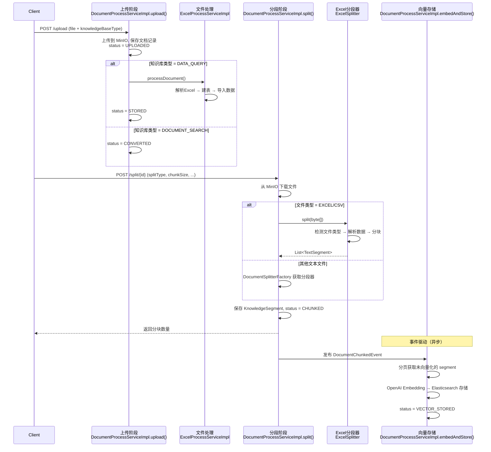
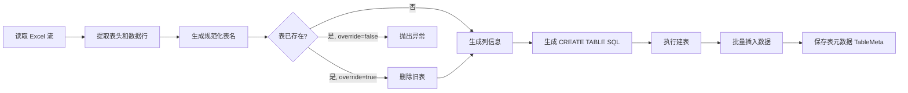
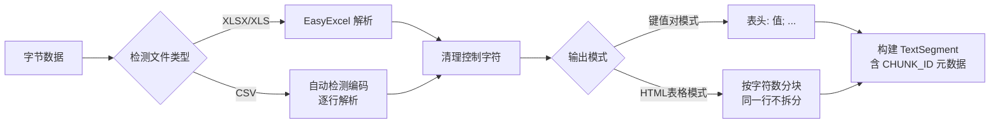
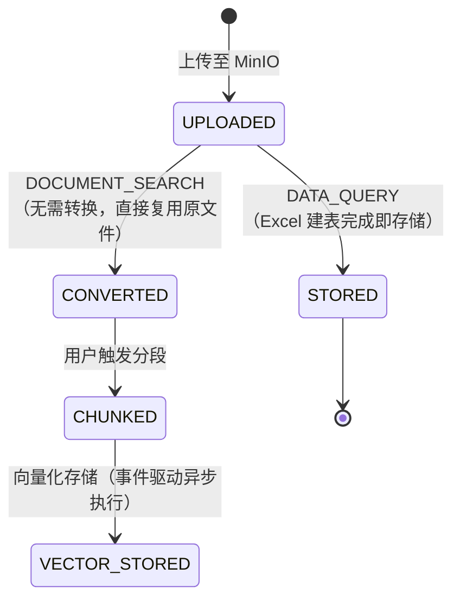

# 文档解析流程

## 整体流程概览

文档处理经过三个阶段，通过事件驱动流转：

文档索引构建流程 文件上传
1. pdf文件上传
2. 存储到minio
3. 将文件解析成markdown
4. 基于markdown做分块，保存到数据库中
5. 基于事件驱动推进状态分页查询数据库，进行向量化

文档中有图片怎么处理
用minerU解析后返回zip，解压上传到minio，替换生成的markdown中为文件存储地址，用多模态模型访问

---

## Excel/CSV 类型解析流程

### 适用文件

| 文件类型 | 扩展名 | 检测方式 |
|---------|--------|---------|
| XLSX | `.xlsx` | ZIP 魔数头（`0x50, 0x4B, 0x03, 0x04`） |
| XLS | `.xls` | OLE 魔数头（`0xD0, 0xCF, 0x11, 0xE0`） |
| CSV | `.csv` | 内容含逗号和换行符 |

### 上游入口：文档控制器

**类**: `KnowledgeDocumentController`

| 接口 | 方法 | 用途 |
|------|------|------|
| `POST /api/document/upload` | `uploadFile()` | 上传文件，触发转换或建表 |
| `POST /api/document/split/{documentId}` | `splitDocument()` | 触发文档分段 |
| `POST /api/document/embedding` | `embedding()` | 手动触发向量化存储 |

### 第一阶段：上传与建表

**入口方法**: `DocumentProcessServiceImpl.upload()`

1. 调用 `FileStorageService.uploadFile()` 将文件上传到 MinIO，获取 `fileUrl`
2. 构建 `KnowledgeDocument` 记录，保存到数据库（status = `UPLOADED`）
3. 通过 `FileProcessServiceFactory` 获取对应的文件处理服务
   - Excel/CSV + **DATA_QUERY** → `ExcelProcessServiceImpl`
   - 其他组合返回 `null`
4. 如果存在 `FileProcessService`，调用 `processDocument()`

#### Excel 建表流程（ExcelProcessServiceImpl）

`ExcelProcessServiceImpl.processDocument()`

关键步骤：

1. **解析 Excel**：使用 EasyExcel 读取，`headRowNumber(0)` 确保第一行被作为数据读入
2. **生成表名**：前缀 `custom_data_query_` + 清理后的文件名（去扩展名、转小写、替换非法字符）
3. **建表**：生成 `CREATE TABLE IF NOT EXISTS` SQL，列名由表头规范化生成，类型统一 `VARCHAR(500)`
4. **批量插入**：每组 500 行，使用 `JdbcTemplate.execute()` 执行拼接的批量 INSERT（绕过 MyBatis-Plus 的 `BlockAttackInnerInterceptor`）
5. **保存元数据**：`TableMeta` 记录表名、建表 SQL、列信息 JSON

### 第二阶段：分段

**入口方法**: `DocumentProcessServiceImpl.split()`

分段参数通过 `DocumentSplitParam` 传入：

| 参数 | 类型 | 说明 |
|------|------|------|
| `splitType` | String | 分段器类型，Excel 专用分段由文件类型决定 |
| `chunkSize` | Integer | 每段最大字符数，默认 500 |
| `overlap` | Integer | 相邻分段重叠字符数 |
| `titleLevel` | Integer | 按标题切分时的标题层级 |
| `separator` | String | 自定义分隔符 |
| `regex` | String | 正则表达式 |

#### Excel/CSV 分段流程

`ExcelSplitter.split(byte[])`

##### 输出模式

| 模式 | 触发条件 | 输出格式 | 用途 |
|------|---------|---------|------|
| **键值对模式** | `htmlMode=false` | `表头1：值1; 表头2：值2; ...` | 便于语义检索，每行一条记录 |
| **HTML 表格模式** | `htmlMode=true` | `<table>...</table>` | 保持表格结构，按 `chunkSize` 字符数分块 |

HTML 表格模式分块规则（`convertToHtmlChunks`）：
- 表头固定包含在每块中
- 遍历数据行，累积字符数不超过 `chunkSize`
- **同一行不会被拆分到不同分块**
- 若单行字符数超过 `chunkSize`，单独成块（保证至少有一行）

##### 生成 TextSegment

`ExcelSplitter.split()` 返回 `List<TextSegment>`，每段元数据包含：
- `chunkId`: 雪花算法生成的唯一 ID

### 第三阶段：向量化存储

**入口方法**: `DocumentProcessServiceImpl.embedAndStore()`

触发方式：
- **自动**：`split()` 完成后发布 `DocumentChunkedEvent`，`DocumentEventListener.onDocumentChunked()` 异步监听执行
- **手动**：`POST /api/document/embedding?docId=xxx`

流程：

1. 分页查询未向量化的 `KnowledgeSegment`（status = STORED, skipEmbedding = 0, embeddingId IS NULL）
2. 批量调用 `OpenAiEmbeddingModel.embedAll()` 获取嵌入向量
3. 调用 `ElasticsearchEmbeddingStore.addAll()` 存储向量
4. 更新每个 `KnowledgeSegment` 的 `embeddingId` 和 status（= VECTOR_STORED）
5. 所有分段处理完成后，更新 `KnowledgeDocument` 状态为 `VECTOR_STORED`

---

## 文档状态机

## 相关类一览

| 类 | 职责 |
|---|------|
| `KnowledgeDocumentController` | REST 接口：上传、分段、向量化、查询 |
| `KnowledgeDocumentServiceImpl` | 文档基础 CRUD |
| `DocumentProcessServiceImpl` | 核心流程编排：上传 → 转换 → 分段 → 向量化 |
| `FileProcessServiceFactory` | 根据文件类型+知识库类型获取处理服务 |
| `ExcelProcessServiceImpl` | Excel 上传阶段：解析 → 建表 → 导数据 |
| `ExcelSplitter` | Excel/CSV 分段器：双模式输出、智能分块 |
| `DocumentSplitterFactory` | 文本分段器工厂（TITLE/LENGTH/SEPARATOR/REGEX/SMART） |
| `FileStorageService` | MinIO 文件存取 |
| `KnowledgeSegmentService` | 分段记录 CRUD |
| `MarkdownHeaderParentTextSplitter` | 按 Markdown 标题层级分段 |
| `MarkdownHeaderBrotherTextSplitter` | 同级标题合并分段 |
| `DocumentEventListener` | 事件监听：CHUNKED → 自动向量化 |
| `FileTypeUtil` | 文件类型检测（后缀 + Tika MIME） |

## 配置

| 配置项 | 说明 |
|-------|------|
| `minio.bucketName` | MinIO 存储桶名 |
| `spring.ai.openai.embedding.*` | OpenAI Embedding 模型配置 |
| `elasticsearch.*` | Elasticsearch 向量存储配置 |
